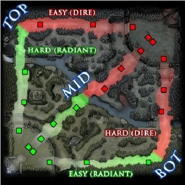
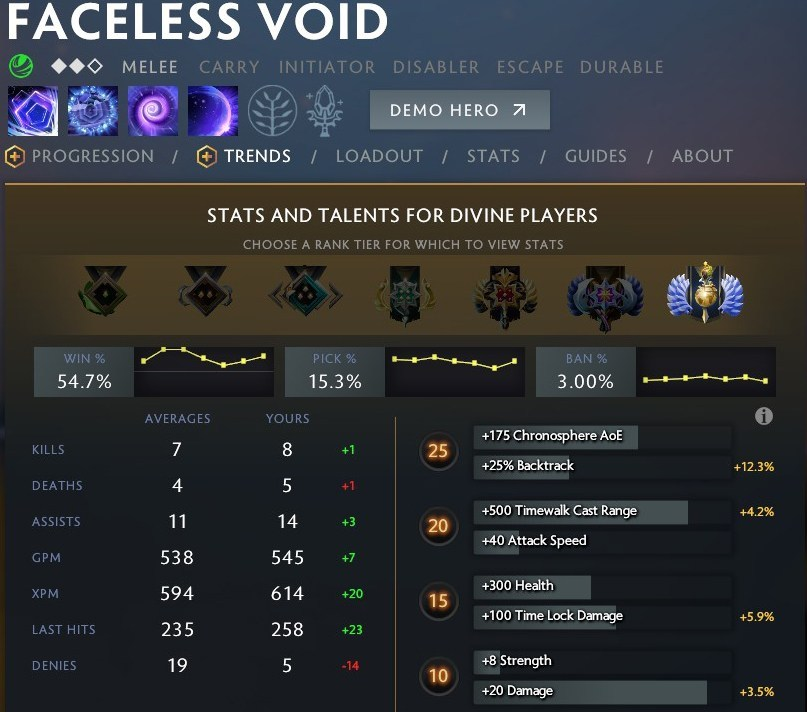
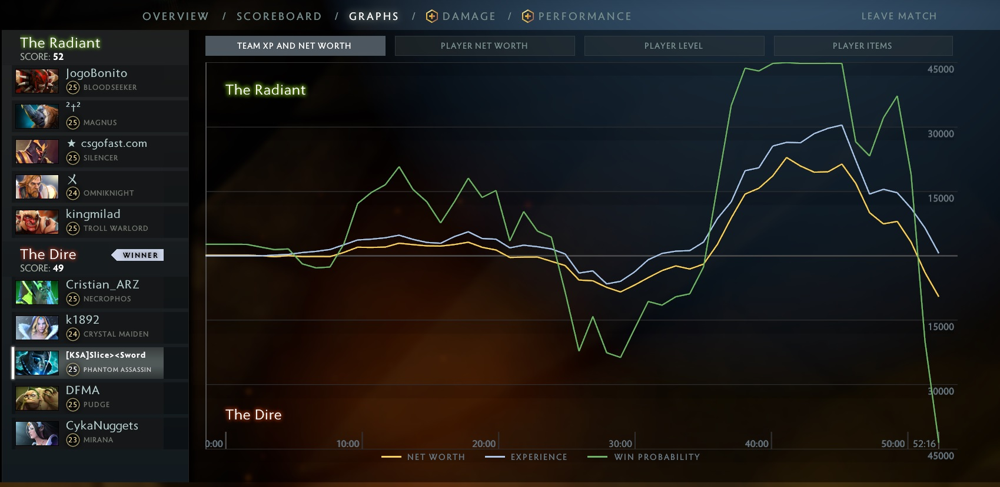

Adam Aguilera
CMSC320 - Introduction to Data Science

## Introduction

Dota 2 is one of the most popular video games to be created. At its all-time peak, Dota 2 was recorded to have [1.2 million players](https://steamcharts.com/app/570) online in a single day. Last month, Dota 2 peaked at [800,000](https://steamcharts.com/app/570) players online in a single day. Gameplay has been increasingly focused on maximizing the smallest of data points to gain any edge possible against opponents. As a result, post-game analytics of Dota 2 games has provided players unique insight into ways to optimize their play to increase their likelihood of winning a match.

# Dota 2 Basics
Dota 2, Defense of the Ancients, is a MOBA-game with 10 players. The map is perfectly split in half with the top-right half representing the Dire team, and the bottom-left half representing the Radiant team. Each team has 11 towers (that attack nearby enemies), 5 players and a base containing the headquarters (known as the ancient). At the start of the game, each player selects a unique hero (a character with special abilities) out of a pool of 119. In order to win the game, one team must take down towers and eventually destroy the opposing side's ancient.


Green represents the Radiant side, and red represents the Dire Side. Each dot symbolizes a tower belonging to the color.

# Gameplay

The game revolves around [creeps](https://dota2.gamepedia.com/Creeps), NPC units that spawn for each team every 60 seconds. [Neutral creeps](https://dota2.gamepedia.com/Neutral_creeps) also spawn every 60 seconds around the map that do not belong to a team. [Gold](https://dota2.gamepedia.com/Gold) is gained primarily gained through killing creeps, killing enemy heroes, destroying towers and a static passive income for all players. Players purchase items with gold to deal more damage, gain more health, walk faster, etc. which in turn, increases their impact on the game.

For a deeper understanding of Dota 2 gameplay, please check out these resources:
[This is Dota](https://www.youtube.com/watch?v=9Szj-CloJiI&ab_channel=PurgeGamers)
[Dota 2 Guide](https://gosu.ai/blog/dota2/how-to-play-dota-2-from-beginner-to-a-pro-player-the-definitive-guide/)
[Dota 2 Wikipedia](https://dota2.gamepedia.com/Dota_2_Wiki)

# Machine Learning in Dota
On March 12, 2018, the creators of Dota 2 announced the first permanent premium subscription service offered to its players ever called [Dota Plus](https://dota2.gamepedia.com/Dota_Plus#Statistics). A perk of this subscription is access to machine learning algorithms that recommend players certain actions based on all the previous games ever played. An example of an extremely advantageous algorithm is the hero pick recommendation. Based on previous games and their outcomes, it will recommend the player the most optimal heroes to select to maximize their probability of winning. Other algorithms focus strictly on post-game analytics. An example of this is an estimated win-probability chart that will tell subscribers the estimated probability they win at a given moment of the game. This can be useful to a player who is trying to figure out at exactly what moment did their team start making mistakes and lost the game. 



# Objectives

In this tutorial, I will explain a data lifecycle to perform analysis on the expected winner of a Dota 2. This analysis will provide similar functionality to the premium win-probability algorithm offered in Dota Plus. 

## Environment / Data Collection
This tutorial is based on R, version 3.6.2, with the following libraries. I accessed both datasets from a [Kaggle](https://www.kaggle.com/c/mlcourse-dota2-win-prediction) competition based on creating the best win-prediction algorithm for dota 2.

```{r setup}
set.seed(5361)
library(caret)
library(tidyverse)
library(lubridate)
library(randomForest)
library(pROC)
train_features = read.csv("train_features.csv")
train_targets = read.csv("train_targets.csv")
```

## Data Explanation

Dota 2 is a complex game with many key-terms that are not self-explanatory. Let's take a look at the datasets and what information they have collected about a game.

```{r explanation}
head(train_targets, 5)
head(train_features, 5)
```

In both datasets, information about match_id_hash and game_time are included. match_id_hash provides us a way to uniquely identify the game the containing row has. game_time tells us the time (in seconds) the game is at when this snippet of data is taken. Both datasets combined contain over 60 different parameters logged in just a single instance of the game! Some of these parameters are more useful than others for predicting the outcome of the game and might unnecessarily increase runtime to provide indiscernible differences (maybe even harmful!). Below I will explain why I chose the following parameters:

# train_targets.csv - Parameter Explanation
radiant_win: This provides us with the winning team at the end of the game. We will need this for our training and validation sets.

time_remaining: A simple formula (total duration of game - current game time = time_remaining). This will provide us information on how close the game is to ending. Games that are closer to the ending are easier to predict as teams will likely show strong advantages (like gold lead, experience lead, etc...) against their opponent.

# train_features.csv -Parameter Explanation
game_mode: There are many different game modes players can play in Dota 2 and each is encoded into a number. I decided to restrict all of our games to [Ranked All-Pick](https://dota2.gamepedia.com/Game_modes#Ranked_All_Pick) because of its competitive nature and zero restrictions or gameplay changes to the base game. (22 is the numeric representation of Ranked All Pick)

Remember, each game has two teams- Radiant or Dire- and 5 players each. The following data is recorded for each player in the game and labeled according to their team and player number. For example, r1 represents Radiant player 1, r2 represents Radiant player 2, d1 represents Dire player 1, d2 represents Dire player 2, etc...

For each player, we will use the following data:
kills: Kills tells us how many times this player has killed an enemy. A team that is willing will likely have more kills than the other team.

deaths: Deaths will tell us how many times a player died to an enemy. This is useful as players with a lot of deaths are giving a lot of gold to the enemy team which makes them less likely to win.

denies: [Denying](https://dota2.gamepedia.com/Denying) is a tactic in Dota to decrease the enemy's opportunity at gold and experience. Teams with more denies will likely have an experience and gold advantage, but it is slightly more complicated than that. Please check out the link for more explanation.

gold: [Gold](https://dota2.gamepedia.com/Gold) shows how much net worth a player has. This is very important as teams with a lead in team net worth are likely to be stronger due to having more powerful items.

lh: [Last Hits](https://dota2.gamepedia.com/Creep_control_techniques#Last-hitting) is the main method for players to get gold. For each last-hit, a player will earn gold. Last hits track the number of times a player got the last hit. A higher number of last hits will be 

xp: [Experience](https://dota2.gamepedia.com/Experience) shows the total amount of experience a player has. Players will higher amounts of experience generally demonstrate higher amounts of creeps killed, heroes killed and assists gained. The amount of experience a player has will also determine their level and grant them bonus [attributes](https://dota2.gamepedia.com/Attributes). 

teamfight_participation: Shows the percentage of team fights the specific player has participated in. Higher participation in team fights can potentially show information about a team's coordination.

towers_killed: [Towers](https://dota2.gamepedia.com/Buildings#Towers) killed demonstrates the progress a team has on destroying the enemy team's base. More towers killed gives information about the progress of the game and who has more control over the map. 

obs_placed: [Observer wards](https://dota2.gamepedia.com/Observer_Ward) provide global vision to the player's team. While it may appear like a minor thing to a non-dota player, this makes a dramatic impact on the game as teams with more vision can gather more information about their opponents and strategize accordingly.

sen_placed: [Sentry wards](https://dota2.gamepedia.com/Sentry_Ward) provide invisibile vision to the player's team. Invisible vision will show invisible items (like observer wards) and enemy heroes (who may have abilities or items to make them invisible) and allow that team to interact with the invisible entity normally. Teams who place more sentry wards typically demonstrate a higher understanding of the game as its mechanics and significance are difficult concepts to understand.

## Data Parsing and Management

Now we know what parameters we want out of our data frame. Let's start creating a subset of our original data frame to start analyzing. To do this, we remove the unnecessary parameters (columns) that aren't going to help us get the best results. 
Given the explanation of the parameters we want, let's start creating a subset of our original data frame to start analyzing.

NOTE: game_mode = 22 represents ranked all pick matches.
```{r datamanagement}
first_df <- merge (x = train_features, y = train_targets[ , c("match_id_hash", "radiant_win")], by = "match_id_hash", all.x =TRUE)
first_df <- first_df[which(first_df$game_mode == 22),]
first_df$objectives_len <- NULL
first_df$lobby_type <- NULL
first_df$match_id_hash <- as.numeric (first_df$match_id_hash)
first_df$chat_len <- NULL
first_df[,c("r1_assists", "r1_health", "r1_max_health", "r1_max_mana", "r1_x", "r1_y", "r1_creeps_stacked", "r1_camps_stacked",
            "r1_rune_pickups", "r1_firstblood_claimed", "r1_hero_id", "r1_roshans_killed", "r1_stuns")] <- list(NULL)
first_df[,c("r2_assists", "r2_health", "r2_max_health", "r2_max_mana", "r2_x", "r2_y", "r2_creeps_stacked", "r2_camps_stacked",
            "r2_rune_pickups", "r2_firstblood_claimed", "r2_hero_id", "r2_roshans_killed", "r2_stuns")] <- list(NULL)
first_df[,c("r3_assists", "r3_health", "r3_max_health", "r3_max_mana", "r3_x", "r3_y", "r3_creeps_stacked", "r3_camps_stacked",
            "r3_rune_pickups", "r3_firstblood_claimed", "r3_hero_id", "r3_roshans_killed", "r3_stuns")] <- list(NULL)
first_df[,c("r4_assists", "r4_health", "r4_max_health", "r4_max_mana", "r4_x", "r4_y", "r4_creeps_stacked", "r4_camps_stacked",
            "r4_rune_pickups", "r4_firstblood_claimed", "r4_hero_id", "r4_roshans_killed", "r4_stuns")] <- list(NULL)
first_df[,c("r5_assists", "r5_health", "r5_max_health", "r5_max_mana", "r5_x", "r5_y", "r5_creeps_stacked", "r5_camps_stacked",
            "r5_rune_pickups", "r5_firstblood_claimed", "r5_hero_id", "r5_roshans_killed", "r5_stuns")] <- list(NULL)
first_df[,c("d1_assists", "d1_health", "d1_max_health", "d1_max_mana", "d1_x", "d1_y", "d1_creeps_stacked", "d1_camps_stacked",
            "d1_rune_pickups", "d1_firstblood_claimed", "d1_hero_id", "d1_roshans_killed", "d1_stuns")] <- list(NULL)
first_df[,c("d2_assists", "d2_health", "d2_max_health", "d2_max_mana", "d2_x", "d2_y", "d2_creeps_stacked", "d2_camps_stacked",
            "d2_rune_pickups", "d2_firstblood_claimed", "d2_hero_id", "d2_roshans_killed", "d2_stuns")] <- list(NULL)
first_df[,c("d3_assists", "d3_health", "d3_max_health", "d3_max_mana", "d3_x", "d3_y", "d3_creeps_stacked", "d3_camps_stacked",
            "d3_rune_pickups", "d3_firstblood_claimed", "d3_hero_id", "d3_roshans_killed", "d3_stuns")] <- list(NULL)
first_df[,c("d4_assists", "d4_health", "d4_max_health", "d4_max_mana", "d4_x", "d4_y", "d4_creeps_stacked", "d4_camps_stacked",
            "d4_rune_pickups", "d4_firstblood_claimed", "d4_hero_id", "d4_roshans_killed", "d4_stuns")] <- list(NULL)
first_df[,c("d5_assists", "d5_health", "d5_max_health", "d5_max_mana", "d5_x", "d5_y", "d5_creeps_stacked", "d5_camps_stacked",
            "d5_rune_pickups", "d5_firstblood_claimed", "d5_hero_id", "d5_roshans_killed", "d5_stuns")] <- list(NULL)
head(first_df, 5)
```

Now, we have a data frame consisting of snapshots of ranked all pick matches with important information about each player and their current performance at game_time. 

## Exploratory data analysis
The first question in machine learning should be, is this the correct approach to solving this problem? As a dota player myself, I question whether or not a different algorithm, one that simply determines who is winning based on gold lead or advantage lead is sufficient. In fact, discussions all over the internet discuss the importance of last-hitting as the primary key to winning your game. A massive number of [guides](https://www.quora.com/How-can-I-improve-my-last-hitting-skills-in-Dota-2-and-what-are-the-things-that-I-should-and-should-not-do-in-the-Laning-phase), [forum posts](https://www.reddit.com/r/DotA2/comments/3o0n8j/how_to_improve_at_dota_a_guide_for_low_mmr_players/), and [youtube videos](https://www.youtube.com/watch?v=u0rYxCVRrUM) exist surrounding the optimization of last-hitting showing a perceived correlation between getting more last-hits and winning the game. Let's see how well it performs.

First, we want to gather the sum of all the last hits from each player on team Radiant, then compare it to all the last hits on team Dire. Then, we want to add in which team ended up winning the match. To make our basic prediction, we guess which team will win by which team has the greater amount of last hits.

```{r lasthits}
temp_df <- transform (first_df, radiant_lasthits = r1_lh + r2_lh + r3_lh + r4_lh + r5_lh)
temp_df <- transform (temp_df, dire_lasthits = d1_lh + d2_lh + d3_lh + d4_lh + d5_lh)
lh_df <- temp_df['match_id_hash'] 
lh_df <- merge (lh_df, temp_df[,c("match_id_hash", "radiant_lasthits", "dire_lasthits", "radiant_win")], by="match_id_hash")
lh_df$radiant_win <- as.character (lh_df$radiant_win)
predict_win <- function (x, y) if (x >= y) {"True"} else {"False"}
lh_df$predict_radiant <- mapply(predict_win, lh_df$radiant_lasthits, lh_df$dire_lasthits)
correct_predict <- function (x, y) if (x==y) {"True"} else {"False"}
lh_df$correct <- mapply(correct_predict, lh_df$predict_radiant, lh_df$radiant_win)
res <- as.data.frame(table (lh_df$correct))
names(res) <- c("correct_prediction", "frequency")
res
```

The results show that 20,153 games were correctly predicted out of 31,763 total games (63.4%). It is a poor result and is barely better than randomly predicting. However, this makes sense. Many places falsely correlate a greater number of last-hits to winning the game. In Dota 2, some heroes in the game are strictly better at getting last hits but have lower [attributes](https://dota2.gamepedia.com/Attributes) or weaker [abilities](https://dota2.gamepedia.com/Abilities) to account for this difference. Undeniably, gold is a much better predictor of the outcome of a game. Unlike abilities and attributes gain, items provide the same (with a few exceptions) effect to all heroes in the game. Items are priced at the same cost to all heroes in Dota 2, meaning a team with a gold lead will generally have an advantage over their enemies. So using the same method for last hits, let's look at how gold predicts the outcome of games.

```{r gold}
temp_df <- transform (first_df, radiant_gold = r1_gold + r2_gold + r3_gold + r4_gold + r5_gold)
temp_df <- transform (temp_df, dire_gold = d1_gold + d2_gold + d3_gold + d4_gold + d5_gold)
gold_df <- temp_df['match_id_hash'] 
gold_df <- merge (gold_df, temp_df[,c("match_id_hash", "radiant_gold", "dire_gold", "radiant_win")], by="match_id_hash")
gold_df$radiant_win <- as.character (gold_df$radiant_win)
predict_win <- function (x, y) if (x >= y) {"True"} else {"False"}
gold_df$predict_radiant <- mapply(predict_win, gold_df$radiant_gold, gold_df$dire_gold)
correct_predict <- function (x, y) if (x==y) {"True"} else {"False"}
gold_df$correct <- mapply(correct_predict, gold_df$predict_radiant, gold_df$radiant_win)
res <- as.data.frame(table (gold_df$correct))
names(res) <- c("correct_prediction", "frequency")
res
```

A significant difference is shown in these results. By simply analyzing the difference in gold, we are able to correctly predict the outcome of 71.8% of the games in the dataset. While not perfect, it demonstrates a reasonable challenge against the use of machine learning to approach this problem.

## Machine Learning

With no further modifications to our dataset, let's see how well machine learning performs. I decided to use a random forest, with 25 variables available at each node (to account for the high number of parameters), and 500 trees to ensure we see the consistent result. We are looking to see if the unmodified dataset will outperform the 71.8% baseline established by predicting off the gold lead.

```{r firstml}
first_train <- sample (nrow(first_df), 0.7*nrow(first_df), replace = FALSE)
first_trainset <- first_df[first_train,]
first_validset <- first_df[-first_train,]
first_model <- randomForest(radiant_win ~ ., data = first_trainset, ntree = 500, mtry =25, importance = TRUE)
first_model
```

Our random forest model produced an out-of-bag error of 29.45%. Lets test our model with the validset and see in practice how effective it is at predicting the outcome of matches.
```{r firstpredict}
predTrain <- predict(first_model, first_trainset, type = "class")
# Checking classification accuracy
table(predTrain, first_trainset$radiant_win) 
# Predicting on Validation set
predValid <- predict(first_model, first_validset, type = "class")
# Checking classification accuracy
mean(predValid == first_validset$radiant_win)                    
table(predValid, first_validset$radiant_win)
```

When used on a valid set, the random forest model produced an accuracy of 70.5%. This would mean that the random forest model is no better at predicting the game than by simply looking at the gold difference from each team. Interestingly enough, these results might show that the game is much less about factors like last-hitting or item purchases and more about gold difference. Now let's plot an ROC AUC

```{r firstroc}
first_roc<-roc(first_trainset$radiant_win,first_model$votes[,2])
plot(first_roc,
         xlab = "False positive rate",
         ylab = "True positive rate",
     main = "ROC Curve - All Games")
auc(first_roc)
```

## Initial Analysis

Our results show no real reason to prefer machine learning over our hypothesis of gold difference. Neither is perfectly accurate at guessing the outcome to games with the given dataset. However, it is important to remember the game_time parameter and its information. By looking at the datasets provided from Kaggle, game_time consists of all different game states. Some games in the dataset just started, others are in the first few minutes and others might be a few seconds from ending.

For both the gold difference and machine learning algorithm, it is more difficult to correctly guess the outcome of the game if it had just started. The reason behind this is the person standing behind the computer, the player. Players are human and can easily make mistakes that will lose them a game where they have a strong advantage. The limitations of this dataset in comparison to Dota Plus is the scope of the dataset. Each match_id_hash only contains a single moment of the game, whereas Dota Plus has access to an entire game. Take a look at the Dota Plus Win Probability Graph: 



As you can see, if a prediction is made at 10:00 to ~23:00, the algorithm would have selected the Radiant team to win. In contrast, from ~23:00 to ~35:00 the algorithm shows the Dire team to be winning. Then from ~35:00 to 47:00, the algorithm shows the Radiant team to be crushing the Dire team with almost 100% chance of winning. Funny enough, the Dire team won the game in the last 3 minutes. Maybe you can't truly predict the outcome of the game when humans are the ones playing.

## Tinkering with the dataset

We learned that any algorithm is bound to have high false-positive rates when trying to predict the outcome of a 40 minute game in the first 2 minutes. Remember the parameter time_remaining? Well we can use this information to subset our dataframe and see if we can more accurately predict the outcome of the game as it is close to the end.

I decided to create two more forests, with one containing data only from games with 10 more minutes before it ended and the other with only 5 minutes left. If we know the game is about to end, the team with an advantage is more likely to hold onto it and win the game. So let's test this new hypothesis.

```{r betterdata}
train_targets$match_id_hash <- as.numeric (train_targets$match_id_hash)
better_df <- merge (x = first_df, y = train_targets[, c("match_id_hash", "time_remaining")], by = "match_id_hash", all.x =TRUE)
better_df <- better_df[which(better_df$time_remaining < 600),]
best_df <- better_df[which(better_df$time_remaining < 300),]
head(better_df, 5)
head(best_df, 5)
```

better_df represents a dataframe of games with 10 minutes remaining or less. best_df represents a dataframe of games with 5 minutes remaining or less. We will generate the random forest for both and analyze their performance.

```{r betterml}
better_train <- sample (nrow(better_df), 0.7*nrow(better_df), replace = FALSE)
better_trainset <- better_df[better_train,]
better_validset <- better_df[-better_train,]
better_model <- randomForest(radiant_win ~ ., data = better_trainset, ntree = 1000, mtry =25, importance = TRUE)
better_model
```
```{r betteranalysis}
predTrain <- predict(better_model, better_trainset, type = "class")
# Checking classification accuracy
table(predTrain, better_trainset$radiant_win) 
# Predicting on Validation set
predValid <- predict(better_model, better_validset, type = "class")
# Checking classification accuracy
mean(predValid == better_validset$radiant_win)                    
table(predValid, better_validset$radiant_win)
better_roc<-roc(better_trainset$radiant_win,better_model$votes[,2])
plot(better_roc,
         xlab = "False positive rate",
         ylab = "True positive rate",
     main = "ROC Curve - <10 Min Remaining")
auc(better_roc)
```
With the updated dataset, our random forest produced an OOB error rate of 11.9%. When tested against the valid set, it was correct 89% of the time. In contrast to our first model, we are now much more accurately able to predict who wins with the restriction on gametime. Let's see how big of a difference 10 minutes is from 5 minutes.

```{r bestml}
best_train <- sample (nrow(best_df), 0.7*nrow(best_df), replace = FALSE)
best_trainset <- best_df[best_train,]
best_validset <- best_df[-best_train,]
best_model <- randomForest(radiant_win ~ ., data = best_trainset, ntree = 1000, mtry =25, importance = TRUE)
best_model
```

```{r bestanalysis}
predTrain <- predict(best_model, best_trainset, type = "class")
# Checking classification accuracy
table(predTrain, best_trainset$radiant_win) 
# Predicting on Validation set
predValid <- predict(best_model, best_validset, type = "class")
# Checking classification accuracy
mean(predValid == best_validset$radiant_win)                    
table(predValid, best_validset$radiant_win)
best_roc<-roc(best_trainset$radiant_win,best_model$votes[,2])
plot(best_roc,
         xlab = "False positive rate",
         ylab = "True positive rate",
     main = "ROC Curve - <5 Min Remaining")
auc(best_roc)
```

Our best model was able to produce an OOB error rate of 9.57%. When tested against the valid set, it was correct in 92.7% of predictions. This makes our best model the strongest predictor of who will win. However, it comes with a major restriction on remaining_time. Let's compare the ROC curve of each of our models to visualize the difference between each model we created.

```{r full_roc}
plot (best_roc, col="green", main = "ROC curves",
         xlab = "False positive rate",
         ylab = "True positive rate")
plot (better_roc, add = TRUE, col="blue")
plot (first_roc, add = TRUE, col="red")
legend("bottomright", title = "Remaining Game Length", 
       legend=c("<5min","<10min", "All Games"), col=c("green", "blue", "red"), lty=1, cex=0.8,)
```

## End Message

When comparing the true positive and false positive rates of each of our models, we can see how signifciant it was to factor the dataset around time_remaining. Our model is only strong at predicting the outcome when the game is near ending. Again, this makes a lot of sense. If a game is about to end and a team shows an advantage, it is extremely likely that team is going to win the game. However, the question of whether machine learning is necessary to predict the outcome of a game is yet to be known. Let's take a look at the gold difference algorithm and see how it comes when we use data from games only 5 minutes from ending.

``` {r finalcompare}
temp_df <- transform (first_df[which(better_df$time_remaining < 300),], radiant_gold = r1_gold + r2_gold + r3_gold + r4_gold + r5_gold)
temp_df <- transform (temp_df, dire_gold = d1_gold + d2_gold + d3_gold + d4_gold + d5_gold)
gold_df <- temp_df['match_id_hash'] 
gold_df <- merge (gold_df, temp_df[,c("match_id_hash", "radiant_gold", "dire_gold", "radiant_win")], by="match_id_hash")
gold_df$radiant_win <- as.character (gold_df$radiant_win)
predict_win <- function (x, y) if (x >= y) {"True"} else {"False"}
gold_df$predict_radiant <- mapply(predict_win, gold_df$radiant_gold, gold_df$dire_gold)
correct_predict <- function (x, y) if (x==y) {"True"} else {"False"}
gold_df$correct <- mapply(correct_predict, gold_df$predict_radiant, gold_df$radiant_win)
res <- as.data.frame(table (gold_df$correct))
names(res) <- c("correct_prediction", "frequency")
res
```

In games about to end in 5 minutes, 5935  out of 3928 games were correctly predicted based strictly on which team had a gold advantage. This result, ~71.8%, is remarkably consistent to its prediction of all games (~71.8% made in our data exploration). As a result, we can say that our machine learning algorithm is significantly more accurate at predicting games near ending in comparison to our gold difference algorithm. With more information regarding the player, instead of just their stats in that single game, we could possibly improve the results of machine learning algorithm across all games. With that being said, this algorithm shows it can be quite useful for showing some post-game analytics if mapped across an entire game (hundreds of thousands of people pay 4$ a month for access to resources like this!).

